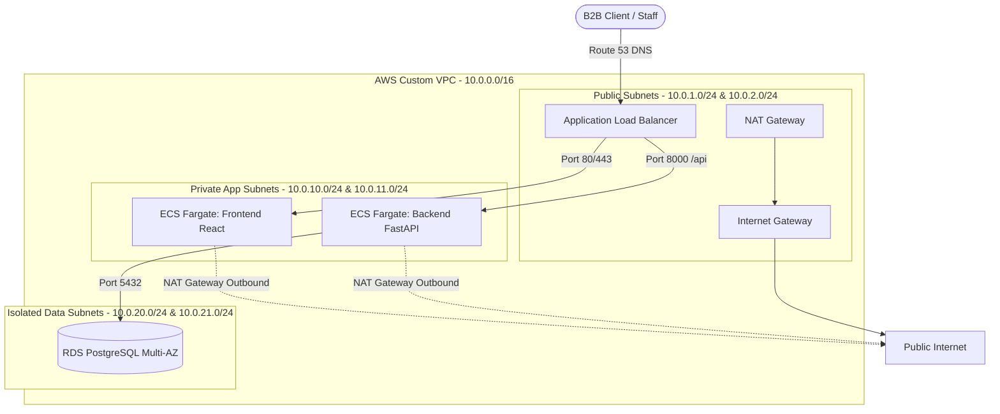

# ApparelCloud - Wholesale ERP/CRM/WMS

ApparelCloud is a high-fidelity full-stack ERP/CRM/WMS management system engineered for wholesale clothing operations. This repository contains the complete codebase designed for AWS cloud deployment, supporting Docker containerization, database persistence, and horizontal auto-scaling.

Designed to satisfy the requirements of **BTEC Unit 6 Cloud Networking**, this document serves as a complete architectural guide and deployment handbook.

---

## Technical Stack
- **Backend**: Python 3.11+, FastAPI (REST API), SQLAlchemy (async), PostgreSQL (database), Pydantic v2 (schemas), PyJWT (security).
- **Frontend**: React 18+, TypeScript, Vite (bundler), Tailwind CSS (styling), Recharts (data visualizations), Lucide Icons.
- **Infrastructure**: Docker, Docker Compose, AWS (VPC, ECS Fargate, RDS PostgreSQL, ALB, Route 53, CloudWatch).
- **CI/CD**: GitHub Actions (linting, building, push to AWS ECR).

---

## 1. Local Development Setup

To run the entire system locally using Docker Compose, execute the following commands in the project root:

```bash
# 1. Clone or navigate into the directory
cd apparel-cloud

# 2. Spin up Postgres, backend API, and React frontend
docker-compose up --build
```

### Accessing the services locally:
- **React Frontend**: [http://localhost:3000](http://localhost:3000)
- **FastAPI Backend (Swagger API Docs)**: [http://localhost:8000/docs](http://localhost:8000/docs)
- **Health Check Endpoint**: [http://localhost:8000/health](http://localhost:8000/health)

### Default Local Credentials:
- **Operator Account**: `admin@apparelcloud.com`
- **Password**: `admin123`

---

## 2. AWS Cloud Infrastructure Architecture

For the BTEC Unit 6 Cloud Networking assignment, follow this blueprint to deploy a secure, resilient, and auto-scaled infrastructure on AWS:



### Step-by-Step Deployment Steps:

### Step 2.1: VPC Setup
1. Open the **AWS VPC Console** and select "Create VPC".
2. Configure **VPC and More**:
   - **Name tag**: `apparel-cloud-vpc`
   - **IPv4 CIDR block**: `10.0.0.0/16`
   - **Number of Availability Zones (AZs)**: `2` (e.g., `us-east-1a` and `us-east-1b` for high availability).
   - **Public Subnets**: `2` (CIDRs: `10.0.1.0/24`, `10.0.2.0/24`).
   - **Private Subnets**: `4` (App subnets: `10.0.10.0/24`, `10.0.11.0/24`; Data subnets: `10.0.20.0/24`, `10.0.21.0/24`).
   - **NAT Gateways**: `1 per AZ` (Production-ready) or `1 in total` (Cost savings).
   - **VPC Endpoints**: S3 Gateway (Optional, optimizes ECR pulling).

### Step 2.2: RDS PostgreSQL Database Setup
1. Go to the **Amazon RDS Console** and select "Create Database".
2. Configuration:
   - **Engine type**: PostgreSQL (v15 or v16).
   - **Templates**: Dev/Test (or Production for Multi-AZ mirroring).
   - **Settings**:
     - DB instance identifier: `apparel-cloud-db`
     - Master username: `apparel_user`
     - Password: Choose a strong password.
   - **Connectivity**:
     - Virtual Private Cloud (VPC): Select `apparel-cloud-vpc`.
     - Subnet Group: Create a group containing the private data subnets (`10.0.20.0/24`, `10.0.21.0/24`).
     - Public access: **No** (Critical security standard).
     - VPC security group: Create `apparel-db-sg`. Allow inbound TCP on port `5432` only from the `apparel-backend-sg`.

### Step 2.3: Amazon ECR Setup (Registry)
Create two private repositories in the **Amazon Elastic Container Registry (ECR)**:
- `apparel-cloud-backend`
- `apparel-cloud-frontend`

```bash
# Example AWS CLI commands to create ECR repos:
aws ecr create-repository --repository-name apparel-cloud-backend --region us-east-1
aws ecr create-repository --repository-name apparel-cloud-frontend --region us-east-1
```

### Step 2.4: ECS Cluster & Task Definitions
1. Open the **Amazon ECS Console** and create a cluster named `apparel-cloud-cluster`.
2. Create **Task Definitions** (Fargate launch type):
   - **Backend Task**:
     - Container Name: `backend`
     - Image URI: `<aws_account_id>.dkr.ecr.us-east-1.amazonaws.com/apparel-cloud-backend:latest`
     - Port mappings: `8000` (TCP)
     - Environment Variables:
       - `DATABASE_URL`: `postgresql+asyncpg://apparel_user:<password>@<rds_endpoint>:5432/apparel_cloud`
       - `SECRET_KEY`: `<secure_jwt_random_string>`
       - `ALGORITHM`: `HS256`
       - `ACCESS_TOKEN_EXPIRE_MINUTES`: `120`
       - `CORS_ORIGINS`: `https://apparel.yourdomain.com`
   - **Frontend Task**:
     - Container Name: `frontend`
     - Image URI: `<aws_account_id>.dkr.ecr.us-east-1.amazonaws.com/apparel-cloud-frontend:latest`
     - Port mappings: `80` (TCP)

### Step 2.5: Application Load Balancer (ALB) Setup
1. Create an Internet-facing **Application Load Balancer** named `apparel-alb` in the public subnets.
2. Define **Target Groups**:
   - `tg-backend`: Port `8000` (HTTP), health check path `/health`.
   - `tg-frontend`: Port `80` (HTTP), health check path `/`.
3. Configure **Listeners and Routing Rules**:
   - Listener HTTP (`80` / `443` HTTPS):
     - Path `/api/*` -> Forward to `tg-backend`
     - Path `/health` -> Forward to `tg-backend`
     - Default Rule -> Forward to `tg-frontend`

### Step 2.6: Auto-Scaling Configuration
Define auto-scaling parameters under the **ECS Services** definition:
- **Min capacity**: `2` tasks (distributed in separate AZs).
- **Max capacity**: `10` tasks.
- **Scaling Policy**: Target Tracking Policy.
  - Metric: **Average CPU Utilization** at `70%`.
  - Metric: **Average Memory Utilization** at `70%`.
  - Scale-out cooldown: `60 seconds`.
  - Scale-in cooldown: `300 seconds`.

### Step 2.7: Route 53 Domain Binding
1. Register a domain or configure hosted zones in **AWS Route 53**.
2. Create an **A Record** (Alias) pointing your domain `apparel.yourdomain.com` directly to the DNS name of the `apparel-alb`.
3. Request an **SSL Certificate** via **AWS Certificate Manager (ACM)** to enable encrypted SSL/TLS (HTTPS) traffic.

---

## 3. CI/CD Pipeline Setup

The automated pipeline defined in `.github/workflows/ci-cd.yml` automates testing and deployment:
1. **Trigger**: Code pushed to `main` branch.
2. **Test**: Python testing commands executed in backend.
3. **AWS Authentication**: GitHub securely logs in to AWS using credentials stored in GitHub Secrets.
4. **ECR Push**: Build Docker images for both backend and frontend, tagging them with the Git commit SHA and `:latest`.
5. **ECS Deploy**: Triggers rolling deployment in ECS tasks.

### GitHub Secrets Required:
- `AWS_ACCESS_KEY_ID`
- `AWS_SECRET_ACCESS_KEY`

---

## 4. Auto-Scaling Verification & Stress Testing

To demonstrate Auto-Scaling for BTEC Unit 6 evaluation:
1. Spin up a temporary EC2 instance in the public subnet or use a local network testing tool (like Apache Bench `ab` or Locust).
2. Execute a stress test targeting the ALB endpoint:
   ```bash
   # Send 100,000 requests with a concurrency of 250 requests
   ab -n 100000 -c 250 http://apparel.yourdomain.com/health
   ```
3. Open **AWS CloudWatch Console** to observe the CPU alarm trigger.
4. Check the **ECS Console**: you will see the running tasks count dynamically scale from `2` up to `4` (or more, depending on load duration) to handle traffic spikes.
